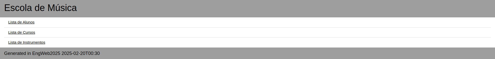

# TPC2 - Escola de Música

**Data:** 2025-02-20

**Autor:** Pedro Filipe Maneta Pinto

**Número Mecanográfico:** A104176

**Foto:**

  

## Problema

Foi proposto desenvolver um serviço em Node.js que contemple os seguintes pontos:

-Construir um serviço em nodejs, que consuma a API de dados servida pelo json-server da escola de música (implementada na segunda aula teórica) e sirva um website com as seguintes caraterísticas:

-Página principal: Listar alunos, Listar Cursos, Listar Instrumentos;

-Página de alunos: Tabela com a informação dos alunos (clicando numa linha deve saltar-se para a página de aluno);

-Página de cursos: Tabela com a informação dos cursos (clicando numa linha deve saltar-se para a página do curso onde deverá aparecer a lista de alunos a frequentá-lo);

-Página de instrumentos: Tabela com a informação dos instrumentos (clicando numa linha deve saltar-se para a página do instrumento onde deverá aparecer a lista de alunos que o tocam).


## Solução
```server.js```: Programa Principal do Servidor em node.js

```mypages.js```: Programa JavaScript que gera as páginas do programa

```db.json```: DataSet Base

## Como Executar

1. Iniciar o JSON Server:
```
json-server -w dados_organizados.json 
```

2. Iniciar o servidor Node.js:
```
node server.js
```

4. Acessar à Página Web em:
```
http://localhost:4321
```

5. Preview do Resultado Final:

  
