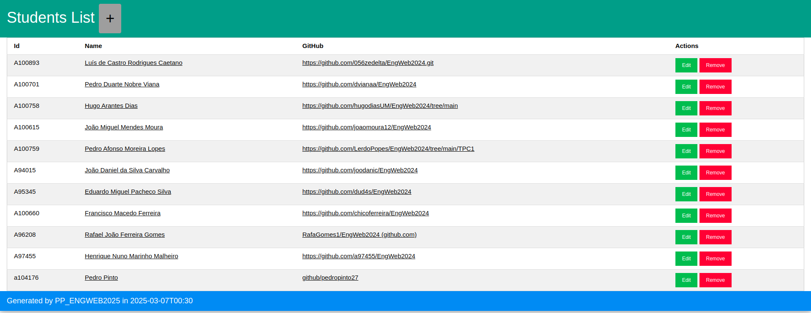

# TPC3 - Gestão de Alunos

**Data:** 2025-03-07

**Autor:** Pedro Filipe Maneta Pinto

**Número Mecanográfico:** A104176

**Foto:**

  

## Descrição

Este projeto implementa um sistema de gestão de alunos para uma escola, permitindo a consulta, adição, edição e remoção de informações dos estudantes. O objetivo é oferecer uma interface simples e eficiente para administrar os dados dos alunos, incluindo nome, ID, link do GitHub e a lista de Trabalhos de Casa (TPCs) concluídos.


## Funcionalidades
-Listagem de Alunos: Exibe todos os alunos registados no sistema, incluindo nome, ID e link do GitHub.

-Detalhes do Aluno: Mostra informações completas de um aluno específico, incluindo os TPCs realizados.

-Adicionar Aluno: Permite registar um novo aluno no sistema, fornecendo os seus dados.

-Editar Aluno: Possibilita a atualização das informações de um aluno existente.

-Remover Aluno: Permite excluir um aluno do sistema.

## Endpoints

1. GET:
```
GET /: Página inicial (Landing page).
GET /alunos: Lista de alunos registados.
GET /alunos/{id}: Detalhes de um aluno específico, identificado pelo ID.
GET /alunos/registo: Formulário para adicionar um novo aluno.
GET /alunos/edit/{id}: Formulário para editar as informações de um aluno existente.
GET /alunos/delete/{id}: Remove um aluno do sistema com o método get.
```

2. POST:
```
POST /alunos/registo: Submissão do formulário para adicionar um novo aluno.
POST /alunos/edit/{id}: Submissão do formulário para editar as informações de um aluno com o método post.
```

2. DELETE:
```
DELETE /alunos/delete/{id}: Remove um aluno do sistema com o método delete.
```

## Preview do Resultado Final:

  
