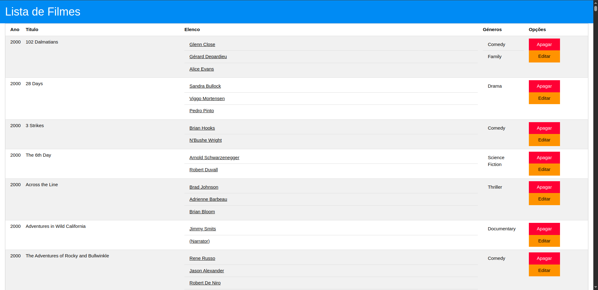

# TPC4 - Gestão de Filmes

**Data:** 2025-03-18

**Autor:** Pedro Filipe Maneta Pinto

**Número Mecanográfico:** A104176

**Foto:**

  

## Descrição

Este projeto implementa um sistema de gestão de filmes, permitindo a consulta, adição, edição e remoção de informações sobre filmes. O objetivo é oferecer uma interface web simples e eficiente para administrar uma coleção de filmes, incluindo título, ano, elenco, gêneros e opções de edição e exclusão.


## Funcionalidades
- Listagem de Filmes: Exibe todos os filmes registrados no sistema, incluindo ano, título, elenco, gêneros e opções de edição/exclusão.

- Filmes por Ator: Permite filtrar e exibir filmes associados a um ator específico do elenco.

- Editar Filme: Possibilita a atualização das informações de um filme existente, como título, ano, elenco e gêneros.

- Remover Filme: Permite excluir um filme do sistema.

## Endpoints

1. GET:
```
GET /: Página inicial (Landing page).
GET /filmes: Lista de filmes registrados.
GET /filmes/edit/:id: Formulário para editar as informações de um filme existente.
GET /filmes/autor/:nome: Lista de filmes associados a um ator específico.
GET /filmes/delete/:id: Remove um filme do sistema usando o método GET.
```

2. POST:
```
POST /filmes/update/:id: Submissão do formulário para atualizar as informações de um filme.
```

2. DELETE:
```
DELETE /filmes/delete/:id: Remove um filme do sistema usando o método DELETE.
```

## Preview do Resultado Final:

  
