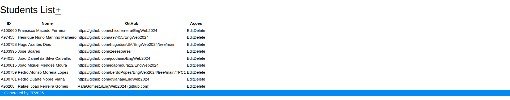

# TPC5 - Sistema de Gestão de Estudantes

**Data:** 2025-03-27

**Autor:** Pedro Filipe Maneta Pinto

**Número Mecanográfico:** A104176

**Foto:**

  

## Descrição

Este projeto implementa um sistema de gestão de estudantes, permitindo a consulta, adição, edição e remoção de informações sobre alunos. O objetivo é oferecer uma interface web simples e eficiente para administrar uma lista de estudantes, incluindo nome, número, GitHub, trabalhos de casa (TPCs) e opções de edição e exclusão.


## Funcionalidades
- Listagem de Estudantes: Exibe todos os estudantes registrados no sistema, incluindo nome, número, GitHub e opções de edição/exclusão.

- Estudantes por TPC: Permite filtrar e exibir os estudantes que completaram trabalhos de casa específicos.

- Editar Estudante: Possibilita a atualização das informações de um estudante existente, como nome, número e GitHub.

- Remover Estudante: Permite excluir um estudante do sistema.

## Endpoints

1. GET:
```
GET /: Página inicial (Landing page).
GET /alunos: Lista de estudantes registrados.
GET /alunos/edit/:id: Formulário para editar as informações de um estudante existente.
GET /alunos/tpc/:id: Lista de estudantes que completaram um determinado TPC.
GET /alunos/delete/:id: Remove um estudante do sistema usando o método GET.

```

2. POST:
```
POST /alunos/update/:id: Submissão do formulário para atualizar as informações de um estudante.
```

2. DELETE:
```
DELETE /alunos/delete/:id: Remove um estudante do sistema usando o método DELETE.
```

## Preview do Resultado Final:

  
