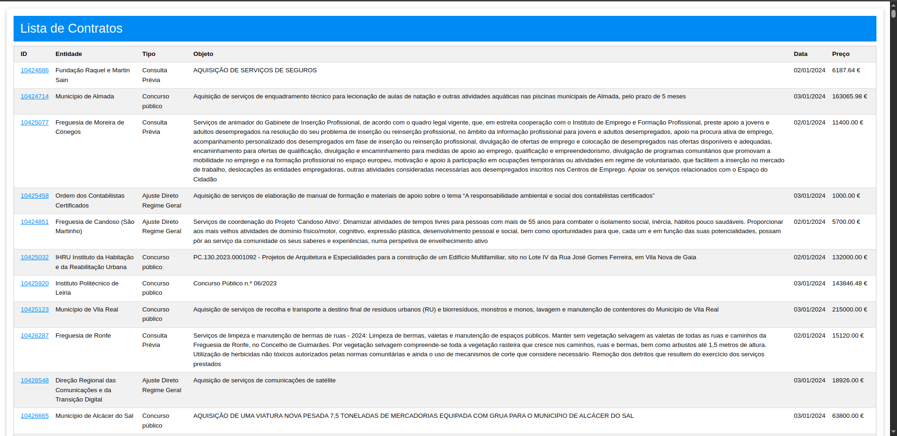

# TPC6 - Sistema de Gestão de Contratos

**Data:** 2025-04-06

**Autor:** Pedro Filipe Maneta Pinto

**Número Mecanográfico:** A104176

**Foto:**

  

## Descrição

Este projeto implementa um sistema de gestão de contratos públicos, dividido em duas componentes principais:

- **API de Dados** (porta `3000`): fornece os contratos diretamente da base de dados em MongoDB.
- **Interface Web** (porta `2525`): consome os dados da API e apresenta-os ao utilizador com uma interface feita em Pug e ajustado com W3.CSS.

O utilizador pode consultar a lista geral de contratos, aceder aos detalhes de um contrato específico e visualizar todos os contratos celebrados por uma determinada entidade.


## Funcionalidades

- Listagem de Contratos: Mostra todos os contratos registados com ID, entidade, tipo, objeto, data e preço.
- Página de Detalhes: Exibe todos os campos de um contrato individual.
- Contratos por Entidade: Mostra todos os contratos celebrados por uma entidade específica, com total.


## Endpoints da API (`localhost:3000`)

```
GET /contratos → Lista completa de contratos
GET /contratos/:id → Detalhes de um contrato por ID
GET /contratos/entidades → Lista de entidades únicas
GET /contratos/entidades/:id → Contratos filtrados por entidade
POST /contratos: Adiciona um novo contrato.
PUT /contratos/:id: Atualiza as informações de um contrato existente.
DELETE /contratos/:id: Remove um contrato do sistema.

```
## Endpoints da Interface (`localhost:2525`)

```
GET /contratos → Página inicial com tabela de contratos
GET /contratos/:id → Detalhes de um contrato específico
```


## Preview do Resultado Final:

  
